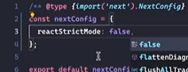
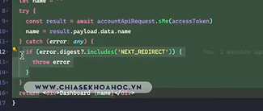

ý tưởng như khóa free => đá về /logout trong middleware khi cái acctoken trong cookie bị xóa đi
=> tạo app/pub/auth/logout

khi acctoken hết hạn thì trong cái cookie tự xóa còn cái lS thì k
khi đó chạy vào middleware

```typescript
const isauth = Boolean(request.cookies.get("accessToken")?.value);
if (privatePaths.some((path) => pathname.startsWith(path) && !isauth)) {
  return NextResponse.redirect(new URL("/logout", request.url));
}
```

=> sẽ đá sang logout

=> tạo app/pub/auth/logout

```typescript
"use client";
import { useLogoutMutation } from "@/queries/useAuth";
import { useRouter } from "next/navigation";
import React, { useEffect } from "react";

const LogoutPage = () => {
  const router = useRouter();
  const logoutMutation = useLogoutMutation();
  useEffect(() => {
    logoutMutation.mutateAsync().then((res) => {
      router.push("/login");
    });
  }, [logoutMutation, router]);
  return <div></div>;
};

export default LogoutPage;
```

viết thế nó sẽ re render vô cực
khi nhảy từ middleWare => sang logout sẽ chạy vòa useE => call mutation => logoutMutation lại bị thay đổi tham chiếu ngay lập tức => chạy lại callback trong useEffect => liên tục

=> cách fix

```typescript
"use client";
import { useLogoutMutation } from "@/queries/useAuth";
import { useRouter } from "next/navigation";
import React, { useEffect } from "react";

const LogoutPage = () => {
  const router = useRouter();
  const { mutateAsync } = useLogoutMutation();
  useEffect(() => {
    mutateAsync().then((res) => {
      router.push("/login");
    });
  }, [mutateAsync, router]); // mutateAsync nó sẽ ko thay đổi
  return <div></div>;
};

export default LogoutPage;
```

=> bị call 2 api logout (do strictmode )
cách tắt strictmode



có 1 cách là abortController => chỉ là hủy kết quả nhận về => ko hay
=> dùng setTimeout => chỉ call 1 lần dù có strict mode

```typescript
"use client";
import { useLogoutMutation } from "@/queries/useAuth";
import { useRouter } from "next/navigation";
import React, { useEffect, useRef } from "react";

const LogoutPage = () => {
  const router = useRouter();
  const { mutateAsync } = useLogoutMutation();
  const ref = useRef<any>(null);

  useEffect(() => {
    if (ref.current) return;
    ref.current = mutateAsync;
    mutateAsync().then((res) => {
      setTimeout(() => {
        ref.current = null;
      }, 1000);

      router.push("/login");
    });
  }, [mutateAsync, router]);
  return <div></div>;
};

export default LogoutPage;
```

vẫn còn rủi ro => nếu người dùng bị lừa ấn vào url logout => check chỉ thực hiện logouut khi token nó giống
=> đá sang url /logout?token=.... cái token khớp với cái token trong cookie thì mới cho logout

```typescript
//middleware
if (privatePaths.some((path) => pathname.startsWith(path) && !isauth)) {
  const url = new URL("/logout", request.url);
  url.searchParams.set(
    "refreshToken",
    request.cookies.get("refreshToken")?.value ?? ""
  );
  return NextResponse.redirect(url);
}
```

chỉ đưa thế này khi người dùng đã đăng nhập và có ref rồi => cần fix thêm case ch đăng nhập

```typescript
import { NextResponse } from "next/server";
import type { NextRequest } from "next/server";

const privatePaths = ["/manage"];
const unAuthPaths = ["/login"];

// This function can be marked `async` if using `await` inside
export function middleware(request: NextRequest) {
  const { pathname } = request.nextUrl;
  const accessToken = Boolean(request.cookies.get("accessToken")?.value);
  const refreshToken = Boolean(request.cookies.get("accessToken")?.value);
  //chưa đăng nhập thì ko cho vào
  if (privatePaths.some((path) => pathname.startsWith(path) && !refreshToken)) {
    return NextResponse.redirect(new URL("/login", request.url));
  }
  //đăng nhập r ko cho vào login nữa
  if (unAuthPaths.some((path) => pathname.startsWith(path) && refreshToken)) {
    return NextResponse.redirect(new URL("/", request.url));
  }
  //hết hạn token(đăng nhập rồi)
  if (
    privatePaths.some(
      (path) => pathname.startsWith(path) && !accessToken && refreshToken
    )
  ) {
    const url = new URL("/logout", request.url);
    url.searchParams.set(
      "refreshToken",
      request.cookies.get("refreshToken")?.value ?? ""
    );
    return NextResponse.redirect(url);
  }
}

// See "Matching Paths" below to learn more
export const config = {
  matcher: ["/manage/:path*", "/login"],
};
```

bên logout page

```typescript
"use client";
import { getRefreshTokenFromLocalstorage } from "@/lib/utils";
import { useLogoutMutation } from "@/queries/useAuth";
import { useRouter, useSearchParams } from "next/navigation";
import React, { useEffect, useRef } from "react";

const LogoutPage = () => {
  const router = useRouter();
  const { mutateAsync } = useLogoutMutation();
  const ref = useRef<any>(null);
  const searchParam = useSearchParams();

  const refreshTokenFromUrl = searchParam.get("refreshToken");

  useEffect(() => {
    if (
      ref.current ||
      refreshTokenFromUrl !== getRefreshTokenFromLocalstorage()
    )
      return;
    ref.current = mutateAsync;
    mutateAsync().then((res) => {
      setTimeout(() => {
        ref.current = null;
      }, 1000);

      router.push("/login");
    });
  }, [mutateAsync, refreshTokenFromUrl, router]);
  return <div></div>;
};

export default LogoutPage;
```

# Còn trường hợp cả 2 cái đều còn vì 1 lí do nào đó trả về 401 (author)=> logout

khi call api lên server backend => trả về 401 => đọc http.ts ( đã xử lí )

```typescript
} else {
        const accessToken = (options?.headers as any)?.Authorization.split(
          "Bearer "
        )[1];
        redirect(`/logout?accessToken=${accessToken}`);
      }
```

đã xử lí bên http nhưng đá về acctoken => ko logout được
=> check thêm ở bên cái logout page cả case accToken

```typescript
"use client";
import {
  getAccessTokenFromLocalstorage,
  getRefreshTokenFromLocalstorage,
} from "@/lib/utils";
import { useLogoutMutation } from "@/queries/useAuth";
import { useRouter, useSearchParams } from "next/navigation";
import React, { useEffect, useRef } from "react";

const LogoutPage = () => {
  const router = useRouter();
  const { mutateAsync } = useLogoutMutation();
  const ref = useRef<any>(null);
  const searchParam = useSearchParams();

  const refreshTokenFromUrl = searchParam.get("refreshToken");
  const accessTokenFromUrl = searchParam.get("accessToken");

  useEffect(() => {
    if (
      ref.current ||
      (refreshTokenFromUrl &&
        refreshTokenFromUrl !== getRefreshTokenFromLocalstorage()) ||
      (accessTokenFromUrl &&
        accessTokenFromUrl !== getAccessTokenFromLocalstorage())
    ) {
      return;
    }

    ref.current = mutateAsync;
    mutateAsync().then((res) => {
      setTimeout(() => {
        ref.current = null;
      }, 1000);

      router.push("/login");
    });
  }, [mutateAsync, refreshTokenFromUrl, router, accessTokenFromUrl]);
  return <div></div>;
};

export default LogoutPage;
```

test
khai báo 1 api call phía server

```typescript
 sMe: (accessToken: string) =>
    http.get<AccountResType>("/accounts/me", {
      headers: {
        Authorization: `Bearer ${accessToken}`,
      },
    }),
```

bên 1 cái component server ào đo

```typescript
import accountApiRequest from "@/apiRequest/account";
import { cookies } from "next/headers";
import React from "react";

const page = async () => {
  const cookieStore = cookies();
  const accessToken = cookieStore.get("accessToken")?.value!;
  const res = await accountApiRequest.sMe(accessToken);

  return <div>Dashboard page {res.payload.data.name}</div>;
};

export default page;
```

có 1 cái bug là khi dùng redirect với server component thì mặc định sẽ throw ra 1 cái lỗi
nếu mà dùng try catch để cl cái error khi call cái sme kia thì sẽ bị báo lỗi
=> xử lí như sau



hoặc là ko dùng try catch nữa là được
=> done

# Phân tích cơ chế RefreshToken ớ nextJs

các api yêu cầu

1. server component => cần api /me ở server để lấy tt profile người dùng
2. client component thì cầm call /me ở client để lấy tt của người dùng

=> hết hạn token xảy ra được ở cả 2 client và server

**các trường hợp hết hạn acctoken**

- đang dùng thì hết hạn => ko cho xảy ra => khi **gần hết** => call ref luôn (react thì đợi hết rồi mới call reftoken => xong call tiếp cái api đang gọi dở) => bằng cách sử dụng setInterval
- lâu ngày ko vào web thì bbh vào lại refToken hết hạn
  khi vào lại web => middleware chạy ddaufat tiên => kiểm tra xem acc còn ko . nếu ko cần thì redirect về client compo call api reftoken => redirect ngược về trang đang sử dụng

# tạo route handle cho refreshtoken

khai báo api để call đã

```typescript
sRefreshToken: (body: RefreshTokenBodyType) => {
    return http.post<RefreshTokenResType>("/auth/refresh-token", body);
  },
  refreshToken: () => {
    return http.post<RefreshTokenResType>("/api/auth/refresh-token", null, {
      baseUrl: "",
    });
  },

```

Viết route handle cho việc refreshToken

```typescript
import authApiRequest from "@/apiRequest/auth";
import { LoginBodyType } from "@/schemaValidations/auth.schema";
import { cookies } from "next/headers";
import jwt from "jsonwebtoken";
import { HttpError } from "@/lib/http";
export async function POST(req: Request) {
  const cookieStore = cookies();
  const refreshToken = cookieStore.get("refreshToken")?.value;
  if (!refreshToken) {
    return Response.json(
      {
        message: "Không nhận được refreshToken",
      },
      {
        status: 401,
      }
    );
  }
  try {
    //call đến server backend
    const { payload } = await authApiRequest.sRefreshToken({
      refreshToken,
    });
    //decode acc và ref để lấy được giờ hết hạn
    const decodedAccessToken = jwt.decode(payload.data.accessToken) as {
      exp: number;
    };
    const decodedRefreshToken = jwt.decode(payload.data.refreshToken) as {
      exp: number;
    };
    //set cookie
    cookieStore.set("accessToken", payload.data.accessToken, {
      path: "/",
      httpOnly: true,
      sameSite: "lax",
      secure: true,
      expires: decodedAccessToken.exp * 1000,
    });
    cookieStore.set("refreshToken", payload.data.refreshToken, {
      path: "/",
      httpOnly: true,
      sameSite: "lax",
      secure: true,
      expires: decodedRefreshToken.exp * 1000,
    });
    //return về
    return Response.json(payload);
  } catch (error: any) {
    if (error instanceof HttpError) {
      return Response.json(error.payload, {
        status: error.status,
      });
    } else {
      return Response.json(
        {
          message: error.message || "Có lỗi xảy ra",
        },
        { status: 401 }
      );
    }
  }
}
```

khi trả về 401 rồi thì call api nó sẽ bị lỗi do cái http nó đã bắt cái lỗi 401 rồi => call logout

# case đang dùng thì refresh token hết hạn

không cho trường hợp này xảy ra
dùng 1 interval để ckeck token liên tục để refresh token trước khi nó hết hạn

1. tạo 1 component refresh token
   src/component/refresh-token.tsx

```typescript
"use client";
import { usePathname } from "next/navigation";
import { useEffect } from "react";

export default function RefreshToken() {
  const pathName = usePathname();
  useEffect(() => {}, [pathName]);
  return null;
}
```

sang app-provider thêm nó vào để nó chạy ở toàn bộ web

```typescript
const AppProvider = ({ children }: { children: React.ReactNode }) => {
  return (
    <QueryClientProvider client={queryClient}>
      {children}
      <RefreshToken />
      <ReactQueryDevtools initialIsOpen={false} />
    </QueryClientProvider>
  );
};
```

viết file src/component/refresh-token.tsx

```typescript
"use client";
import {
  getAccessTokenFromLocalstorage,
  getRefreshTokenFromLocalstorage,
  setAccessTokenToLocalstorage,
  setRefreshTokenToLocalstorage,
} from "@/lib/utils";
import { usePathname } from "next/navigation";
import { useEffect } from "react";
import jwt from "jsonwebtoken";
import authApiRequest from "@/apiRequest/auth";

// các page ko check ref token
const UNAUTHENTICATED_PATH = ["/login", "/logout", "/refresh-token"];
export default function RefreshToken() {
  const pathName = usePathname();

  useEffect(() => {
    if (UNAUTHENTICATED_PATH.includes(pathName)) return;
    let interval: any = null;
    const checkEndRefreshToken = async () => {
      //không nên đưa 2 cái lấy acc và ref ra khỏi func này để mỗi lần check thì lấy cái mới nhất
      const accessToken = getAccessTokenFromLocalstorage();
      const refreshToken = getRefreshTokenFromLocalstorage();
      //chưa đăng nhập ko cho chạy
      if (!accessToken && !refreshToken) return;
      //decode ra
      const decodedAccessToken = jwt.decode(accessToken!) as {
        exp: number;
        iat: number; //thời gian khỏi tạo
      };
      const decodedRefreshToken = jwt.decode(refreshToken!) as {
        exp: number;
        iat: number;
      };
      //thời điểm hết hạn là tính theo s
      // khi dùng cú pháp new date.gettime trả về ms => /1000
      const now = Math.round(new Date().getTime() / 1000);
      // refreshtoken hết hạn thì ko xử lí nữa
      if (decodedRefreshToken.exp <= now) return;
      // nếu acctoken hết hạn là 10s
      // kiểm tra thời gian còn 1/3(3s) thì sẽ cho refresh toke lại
      // thời gian còn lại sẽ tính = decodeAcc.exp - now
      // thời gian hết hạn của accrT dựa trên = decodeAcc.exp - decodeacc.iat
      if (
        decodedAccessToken.exp - now <
        (decodedAccessToken.exp - decodedAccessToken.iat) / 3
      ) {
        //call ref
        try {
          const res = await authApiRequest.refreshToken();
          setAccessTokenToLocalstorage(res.payload.data.accessToken);
          setRefreshTokenToLocalstorage(res.payload.data.refreshToken);
        } catch (error) {
          clearInterval(interval);
        }
      }
    };
    // phải gọi lần đầu vì interval sẽ gọi sau thời gian timeout
    checkEndRefreshToken();
    const TIMEOUT = 1000; // phải bé hơn thời gian hết hạn của acctoken
    interval = setInterval(checkEndRefreshToken, TIMEOUT);

    return () => clearInterval(interval);
  }, [pathName]);
  return null;
}
```

nếu code thế này sẽ bị 1 bug là khi chuyển trang thì cái ref này sẽ được duplicate lên => khi đó sẽ bị lỗi do có 1 cái reftoken api gửi lên cái cũ
sửa bên viết api để hạn chế (hoặc có thể xử lí như bên logout)

```typescript
refreshTokenRequest: null as Promise<{
    status: number;
    payload: RefreshTokenResType;
  }> | null,


  async refreshToken() {
    if (this.refreshTokenRequest) return this.refreshTokenRequest;
    this.refreshTokenRequest = http.post<RefreshTokenResType>(
      "/api/auth/refresh-token",
      null,
      {
        baseUrl: "",
      }
    );
    const res = await this.refreshTokenRequest;
    this.refreshTokenRequest=null
    return res;
  },
```

# Case lâu ngày ko vào web thì hết hạn

khi vòa web middleware call đầu => check acc và ref và điều hướng về trang refresh token và ref tại đây
và redirect về cái trang mà người dùng vừa enter vào trình duyệt

1. tách cái này ra thành 1 hàm bên utils

```typescript
export const checkEndRefreshToken = async (params: {
  onError?: () => void;
  onSuccess?: () => void;
}) => {
  //không nên đưa 2 cái lấy acc và ref ra khỏi func này để mỗi lần check thì lấy cái mới nhất
  const accessToken = getAccessTokenFromLocalstorage();
  const refreshToken = getRefreshTokenFromLocalstorage();
  //chưa đăng nhập ko cho chạy
  if (!accessToken && !refreshToken) return;
  //decode ra
  const decodedAccessToken = jwt.decode(accessToken!) as {
    exp: number;
    iat: number; //thời gian khỏi tạo
  };
  const decodedRefreshToken = jwt.decode(refreshToken!) as {
    exp: number;
    iat: number;
  };
  //thời điểm hết hạn là tính theo s
  // khi dùng cú pháp new date.gettime trả về ms => /1000
  const now = Math.round(new Date().getTime() / 1000);
  // refreshtoken hết hạn thì ko xử lí nữa
  if (decodedRefreshToken.exp <= now) return;
  // nếu acctoken hết hạn là 10s
  // kiểm tra thời gian còn 1/3(3s) thì sẽ cho refresh toke lại
  // thời gian còn lại sẽ tính = decodeAcc.exp - now
  // thời gian hết hạn của accrT dựa trên = decodeAcc.exp - decodeacc.iat
  if (
    decodedAccessToken.exp - now <
    (decodedAccessToken.exp - decodedAccessToken.iat) / 3
  ) {
    //call ref
    try {
      const res = await authApiRequest.refreshToken();
      setAccessTokenToLocalstorage(res.payload.data.accessToken);
      setRefreshTokenToLocalstorage(res.payload.data.refreshToken);
      params?.onSuccess && params?.onSuccess();
    } catch (error) {
      params?.onError && params?.onError();
    }
  }
};
```

2. sử dụng hàm này trong component refreshtoken

```typescript
"use client";
import {
  checkEndRefreshToken,
  getAccessTokenFromLocalstorage,
  getRefreshTokenFromLocalstorage,
  setAccessTokenToLocalstorage,
  setRefreshTokenToLocalstorage,
} from "@/lib/utils";
import { usePathname } from "next/navigation";
import { useEffect } from "react";
import jwt from "jsonwebtoken";
import authApiRequest from "@/apiRequest/auth";

// các page ko check ref token
const UNAUTHENTICATED_PATH = ["/login", "/logout", "/refresh-token"];
export default function RefreshToken() {
  const pathName = usePathname();

  useEffect(() => {
    if (UNAUTHENTICATED_PATH.includes(pathName)) return;
    let interval: any = null;

    // phải gọi lần đầu vì interval sẽ gọi sau thời gian timeout
    checkEndRefreshToken({
      onError: () => {
        clearInterval(interval);
      },
    });
    const TIMEOUT = 1000; // phải bé hơn thời gian hết hạn của acctoken
    interval = setInterval(checkEndRefreshToken, TIMEOUT);
    return () => clearInterval(interval);
  }, [pathName]);
  return null;
}
```

3. sửa lại middleware để redirect

```ts
import { NextResponse } from "next/server";
import type { NextRequest } from "next/server";

const privatePaths = ["/manage"];
const unAuthPaths = ["/login"];

// This function can be marked `async` if using `await` inside
export function middleware(request: NextRequest) {
  const { pathname } = request.nextUrl;
  const accessToken = Boolean(request.cookies.get("accessToken")?.value);
  const refreshToken = Boolean(request.cookies.get("accessToken")?.value);
  //chưa đăng nhập thì ko cho vào
  if (privatePaths.some((path) => pathname.startsWith(path) && !refreshToken)) {
    return NextResponse.redirect(new URL("/login", request.url));
  }
  //đăng nhập r ko cho vào login nữa
  if (unAuthPaths.some((path) => pathname.startsWith(path) && refreshToken)) {
    return NextResponse.redirect(new URL("/", request.url));
  }
  //hết hạn token(đăng nhập rồi)
  if (
    privatePaths.some(
      (path) => pathname.startsWith(path) && !accessToken && refreshToken
    )
  ) {
    // lưu lại cái redirect
    const url = new URL("/refresh-token", request.url);
    url.searchParams.set(
      "refreshToken",
      request.cookies.get("refreshToken")?.value ?? ""
    );
    url.searchParams.set("redirect", pathname);
    return NextResponse.redirect(url);
  }
}

// See "Matching Paths" below to learn more
export const config = {
  matcher: ["/manage/:path*", "/login"],
};
```

4. viết page refresh token

```ts
"use client";
import {
  checkEndRefreshToken,
  getRefreshTokenFromLocalstorage,
} from "@/lib/utils";
import { useRouter, useSearchParams } from "next/navigation";
import React, { useEffect } from "react";

const RefreshTokenPage = () => {
  const router = useRouter();
  const searchParam = useSearchParams();

  const refreshTokenFromUrl = searchParam.get("refreshToken");
  const redirectPathNameFromUrl = searchParam.get("redirect");

  useEffect(() => {
    if (
      refreshTokenFromUrl &&
      refreshTokenFromUrl === getRefreshTokenFromLocalstorage()
    ) {
      checkEndRefreshToken({
        onSuccess: () => {
          router.push(redirectPathNameFromUrl || "/");
        },
      });
    }
  }, [redirectPathNameFromUrl, refreshTokenFromUrl, router]);
  return <div></div>;
};

export default RefreshTokenPage;
```

=> luồng chạy khi vào web tắt web đi ( ấn dấu x tại tab ) => 1 thời gian sau acc hết hạn =>
vào lại web => chyaj middleware => check thấy đang ở route private và cái !acc và re đúng 2 điều kiện này chạy đế cái /refresh-token
sau đó vào cái page /refresh-token để call lại api refresh để lấy lại acctoken
sau đó đá đếm cái redirect luôn nếu láy lại thành công = router.push(redirectPathNameFromUrl || "/");

# Xử lý trường hợp đang dùng thì refresh token hết hạn

thấy bên cái reftoken chạy 1s 1 lần => chạy vòa cái checkEndRef => chạy vào case decodeRef.exp <=now => cho logout luôn(case hết hạn cần xử lí) => xóa LS còn cookie tự xóa

bên hàm checkEndRef

```ts
if (decodedRefreshToken.exp <= now) {
  removeLocalStorage();
  params?.onError && params?.onError();
  return;
}
```

xử lí đá đi ở bên reftoken

```ts
"use client";
import { checkEndRefreshToken } from "@/lib/utils";
import { usePathname, useRouter } from "next/navigation";
import { useEffect } from "react";

// các page ko check ref token
const UNAUTHENTICATED_PATH = ["/login", "/logout", "/refresh-token"];
export default function RefreshToken() {
  const pathName = usePathname();
  const router = useRouter();
  useEffect(() => {
    if (UNAUTHENTICATED_PATH.includes(pathName)) return;
    let interval: any = null;

    // phải gọi lần đầu vì interval sẽ gọi sau thời gian timeout
    checkEndRefreshToken({
      onError: () => {
        clearInterval(interval);
      },
    });
    const TIMEOUT = 1000; // phải bé hơn thời gian hết hạn của acctoken
    interval = setInterval(
      () =>
        checkEndRefreshToken({
          onError: () => {
            clearInterval(interval);
            router.push("/login");
          },
        }),
      TIMEOUT
    );
    return () => clearInterval(interval);
  }, [pathName, router]);
  return null;
}
```

# Fix lỗi refresh token hết hạn nhưng không redirect về login Giải thích về Router Cache Next.js

có 1 cái bug là điều hướng là /login nhưng lại đá về trang chủ khi hết hạn refToken

- không nên làm tròn cái now bên cái hàm checkEndRef
- khi set cookie thường bị lệch từ 0 -1000ms
  => const now = new Date().getTime() / 1000 - 1; (fix 2 case trên)
-

## Giải thích về Router Cache Next.js

Next.js có một tính năng gọi là Router Cache, giúp tăng tốc độ tải trang bằng cách lưu cache
khoảng tầm 30s => trong cái khoảng cache còn thì ko chạy vào middleware

# Xử lý trường hợp lâu ngày vào web thì refresh token hết hạn

chạy middleware rơi vào case

```ts
//chưa đăng nhập thì ko cho vào
if (privatePaths.some((path) => pathname.startsWith(path) && !refreshToken)) {
  return NextResponse.redirect(new URL("/login", request.url));
}
```

bug ui ch xóa ở LS đi => ui menu vẫn ăn

chỉ bị khi patse url chứ nếu mà là cái gõ từng chữ thì next có cái prefecthing => ăn ngay cái / luôn chứ ko đợi cái url xong r ấn enter

middleware

```ts
//chưa đăng nhập thì ko cho vào
if (privatePaths.some((path) => pathname.startsWith(path) && !refreshToken)) {
  const url = new URL("/login", request.url);
  url.searchParams.set("clearToken", "true");
  return NextResponse.redirect(url);
}
```

và sửa bên login form

```ts
const searchParams = useSearchParams();
const clearToken = searchParams.get("clearToken");

useEffect(() => {
  if (clearToken) {
    removeLocalStorage();
  }
}, [clearToken]);
```

có 1 cái case
bên navitem

```ts
useEffect(() => {
  setIsAuth(Boolean(getAccessTokenFromLocalstorage()));
}, []);
```

thì ko biết cái nào chạy trước so với cái useEFf trên => dùng context để định dạng bên cái navitem chứ ko dùng 2 cái useef này nữa
app-provider.tsx

```ts
"use client";

import RefreshToken from "@/components/refresh-token";
import {
  getAccessTokenFromLocalstorage,
  removeLocalStorage,
} from "@/lib/utils";
import {
  useQuery,
  useMutation,
  useQueryClient,
  QueryClient,
  QueryClientProvider,
} from "@tanstack/react-query";
import { ReactQueryDevtools } from "@tanstack/react-query-devtools";
import React, { createContext, useContext, useEffect, useState } from "react";

const queryClient = new QueryClient({
  defaultOptions: {
    queries: {
      refetchOnWindowFocus: false,
      refetchOnMount: false,
    },
  },
});
const AppContext = createContext({
  isAuth: false,
  setIsAuth: (isAuth: boolean) => {},
});
export const useAppContext = () => {
  return useContext(AppContext);
};
const AppProvider = ({ children }: { children: React.ReactNode }) => {
  const [isAuth, setIsAuthState] = useState(false);
  useEffect(() => {
    const accessToken = getAccessTokenFromLocalstorage();
    if (accessToken) {
      setIsAuthState(true);
    }
  }, []);
  const setIsAuth = (isAuth: boolean) => {
    if (isAuth) {
      setIsAuthState(true);
    } else {
      setIsAuthState(false);
      removeLocalStorage();
    }
  };
  return (
    <AppContext.Provider value={{ isAuth: isAuth, setIsAuth: setIsAuth }}>
      <QueryClientProvider client={queryClient}>
        {children}
        <RefreshToken />
        <ReactQueryDevtools initialIsOpen={false} />
      </QueryClientProvider>
    </AppContext.Provider>
  );
};

export default AppProvider;
```

login-form.tsx

```ts
const { setIsAuth } = useAppContext();
useEffect(() => {
  if (clearToken) {
    setIsAuth(false);
  }
}, [setIsAuth, clearToken]);
```

navitem

```ts
"use client";

import { useAppContext } from "@/components/app-provider";
import { getAccessTokenFromLocalstorage } from "@/lib/utils";
import Link from "next/link";
import { useEffect, useState } from "react";

const menuItems = [
  {
    title: "Món ăn",
    href: "/menu",
    authRequired: true,
  },
  {
    title: "Đơn hàng",
    href: "/orders",
    authRequired: true,
  },
  {
    title: "Đăng nhập",
    href: "/login",
    authRequired: false,
  },
  {
    title: "Quản lý",
    href: "/manage/dashboard",
    authRequired: true,
  },
];

export default function NavItems({ className }: { className?: string }) {
  const { isAuth } = useAppContext();

  return menuItems.map((item) => {
    if (
      (item.authRequired === false && isAuth) ||
      (item.authRequired === true && !isAuth)
    )
      return null;
    return (
      <Link href={item.href} key={item.href} className={className}>
        {item.title}
      </Link>
    );
  });
}
```
